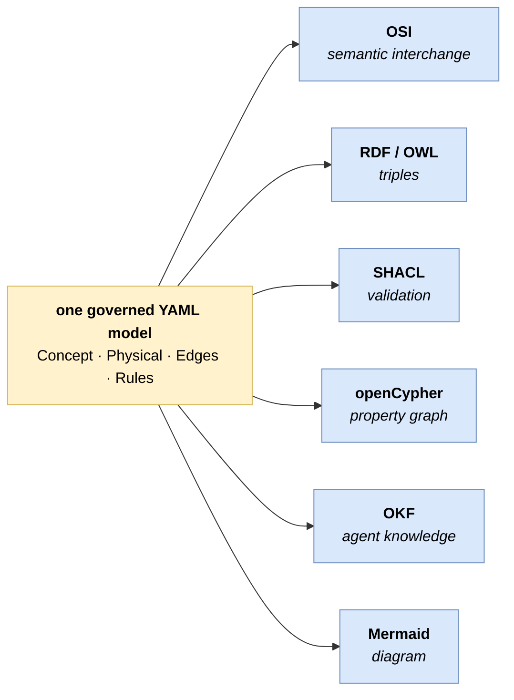

# Meaning as Code (MAC)
#### the YAML Ontology Framework

> *Capturing knowledge and meaning in a structured form is an old pursuit — taxonomies and controlled
> vocabularies, relational schemas, the Semantic Web (RDF/OWL), knowledge graphs, data catalogs, the
> semantic layers of modern BI. **Meaning as Code is one contribution to that long stream, not a
> replacement for it** — it borrows from all of them and tries to be honest about what it is not.*
>
> *Its aspiration is deliberately **not academic**. It exists to solve a problem the IT industry is hitting
> right now: **LLMs are being pointed at structured data and asked to reason over it — and they guess,
> plausibly and wrongly**, because the meaning they need (what a column really is, how a measure aggregates,
> which rows to exclude) was never written down anywhere they can read it. This is an engineer's answer to
> that concrete problem — write the meaning down once, in plain files, so the deterministic half of the
> reasoning stops being a guess.*

**Write down what your data *means* — once, as version-controlled YAML — so an AI agent can read it to
generate correct SQL, any platform can ingest it as its ontology, and a machine can check it before anyone
trusts it.** No vendor owns your meaning; a diff shows when it changes; a gate fails when it breaks.

It aims at a specific empty cell: to be both **full-coverage** (modelling meaning end to end, not one
slice) and **vendor-neutral** (locking into no platform) — the spot the data catalogs, semantic layers,
graph stores, and all-in-one platforms each tend to leave open. See [articles/positioning.md](articles/positioning.md).

**One governed model, every platform.** Author it once; project it — *mechanically, nothing hand-written* —
onto six industry formats, each validated **in its own terms** (not on our say-so):



…and it reads its *own* model back as the answer to a question: `SELECT` from a rule, `JOIN` from an edge,
columns from grounding — the deterministic half of an AI agent's job, pulled out of the model's head and
into a file you can diff, gate, and trust.

## What's in MAC

- **Four layers** — Concept (what it means) · Physical (where it lives) · Edges (how it joins) · Rules
  (how it's computed). One artifact, four kinds of fact.
- **Six closed concept classes** — entity · event · measure · enumeration · reference · grouping. A short
  menu, so a reader — or an LLM — always knows what kind of thing it's looking at.
- **A closed core an LLM can't hallucinate** — only schema-defined keys (plus namespaced `x-` extensions)
  are legal; an invented key is *rejected*. Safe machine authoring, by construction.
- **Three data-free gates** — structural (the schema) · referential (every cross-file reference resolves) ·
  constraint/shapes (relational invariants declared as DATA, run by one generic engine).
- **Field-anchoring** — typed rules **bound to the columns they govern** (`binds`), enforced cross-file: a
  rule cannot claim to govern a field the concept doesn't ground, and the gate proves it.
- **The model generates the SQL** — `SELECT` from a rule, `JOIN` from an edge, tables and columns from
  grounding: the deterministic half of question-answering, shown end-to-end in each example's `QUERIES.md`.
- **Provenance for free** — because every clause traces to a concept, an edge, or a rule, an answer can be
  explained by citing the model — and an unanswerable question is *refused*, not fabricated.
- **Six projectors, each self-validating** — one model → OSI · RDF/OWL · SHACL · openCypher · OKF ·
  Mermaid. None hand-written; each verified *in the target's own terms* (OSI's JSON Schema, a real SHACL
  engine, an RDF re-parse, …). The "projects onto whatever you run" claim, as running code — see
  [articles/projecting-outward.md](articles/projecting-outward.md).
- **Two planes** — a **data plane** (how the data is made: sources → transforms → dataset schemas) and an
  **ontology plane** (what it means: concepts, edges, rules), with one one-directional seam. The Palantir
  Foundry split — datasets/transforms vs. ontology — but **vendor-neutral and in files you own**. Opt-in
  per project via `mac.project.yaml`; absent ⇒ flat (back-compatible). See
  [reference_manual/data_plane.md](reference_manual/data_plane.md).
- **Two worked examples, both two-plane Option B** (structure-only datasets; all column meaning
  field-anchored in the ontology) — a shop, and TPC-H (richer: a hierarchy, an associative entity, a
  composite-key fact, a derived measure, and four closed enumerations), each with a `validate.sh` (all
  three gates) and a `QUERIES.md` (question → SQL).

This repository is the complete, domain-neutral description of the framework, plus the worked examples.

## Projects onto your whole stack — six formats, each self-validating

The thesis isn't "export to one tool"; it's *author meaning once and project the right slice onto whatever
you run*. Six projectors do it mechanically, and each is checked by the **target's own** validator:

| Projector | Target | Self-validation |
| --- | --- | --- |
| [`mac_to_osi.py`](tools/mac_to_osi.py) | **OSI** semantic model (Snowflake et al.) | validates against OSI's own JSON Schema |
| [`mac_to_rdf.py`](tools/mac_to_rdf.py) | **RDF / OWL** Turtle (Stardog, Neptune-RDF) | re-parses as valid RDF |
| [`mac_to_shacl.py`](tools/mac_to_shacl.py) | **SHACL** shapes (W3C) | a real engine (pySHACL) accepts good data, rejects broken |
| [`mac_to_graph.py`](tools/mac_to_graph.py) | **openCypher** property graph (Neo4j, Neptune) | node/edge self-consistency |
| [`mac_to_okf.py`](tools/mac_to_okf.py) | **OKF** agent-knowledge bundle (Google Cloud) | every doc typed; every link resolves |
| [`mac_to_mermaid.py`](tools/mac_to_mermaid.py) | **Mermaid** diagram (renders on GitHub) | renders as a valid flowchart |

No projection asks you to trust the projector — the target's validator is the evidence. One model behind
six independent verdicts. (Outputs live under each example's `projections/`.)

## Start here

| Document | What it is |
| --- | --- |
| [articles/meaning-as-code.md](articles/meaning-as-code.md) | **The narrative** — the idea and objective as an essay: one probabilistic step then deterministic execution, why "as code", the three gates, field-anchoring, the model generating SQL, and where MAC sits vs SHACL/SBVR/SKOS/OSI. **Read this for the story** (then FRAMEWORK.md for the spec). |
| [articles/positioning.md](articles/positioning.md) | **Why this over OSI / catalogs / graph stores / all-in-one platforms** — the coverage × vendor-neutrality argument: single-slice tools own one level, all-in-one platforms own all four but lock you in, MAC is full-coverage *and* neutral; plus how it interoperates with OSI/SHACL/SBVR/OWL. |
| [articles/mac-in-the-loop.md](articles/mac-in-the-loop.md) | **Where MAC sits end-to-end** — the question → interpret → generate SQL → execute → explain-provenance loop; the probabilistic/deterministic split; provenance as a byproduct of meaning-as-code. |
| [articles/projecting-outward.md](articles/projecting-outward.md) | **One model, six formats** — the exporters as the "projects onto whatever you run" proof: OSI · openCypher · RDF/OWL · SHACL · OKF · Mermaid, each self-validating in its target's own terms. |
| [reference_manual/data_plane.md](reference_manual/data_plane.md) | **The two-plane layout** — data plane (how the data is made) vs ontology plane (what it means), the seam, the manifest, and the structure-vs-meaning (Option A → B) split. The Foundry separation, vendor-neutral. |
| **[FRAMEWORK.md](FRAMEWORK.md)** | The canonical description — the problem, the thesis, the four layers, the six classes, the rules layer, the trade-offs, and the projection table (RDF / property-graph / relational). **Read this first.** |
| [CONCEPT_SPEC.md](CONCEPT_SPEC.md) | The exhaustive key-by-key reference — every predefined key and its meaning. |
| [MODELLERS_COOKBOOK.md](MODELLERS_COOKBOOK.md) | The task-oriented guide — *when you're authoring*: decision procedures (which layer? which class? which edge level?), recipes per task, and antipatterns. Routes to the canon; doesn't restate it. |
| [FRAMEWORK_STRUCTURE_MAP.md](FRAMEWORK_STRUCTURE_MAP.md) | The visual companion — diagrams of the object types, layers, and concept anatomy. |
| [example_shop_ontology/](example_shop_ontology/) | A tiny, complete, **synthetic** ontology (an online shop) — the framework applied end-to-end. Read it to *see* every construct, rather than read about it. |
| [mac.schema.json](mac.schema.json) | The **formal, machine-checkable schema** (v0.1.9) — the single source of structural truth: closed vocabulary, class/level/type/role enums, required keys, and the `x-` extension rule. |
| [CONFORMANCE.md](CONFORMANCE.md) | Conformance levels (L0–L3), the closed-core + `x-` extension contract, and the v0.1.9 change list. |
| [tools/validate_schema.py](tools/validate_schema.py) | The **structural** validator — schema-driven (MAC v0.1.9): checks every model file against `mac.schema.json` (closed vocabulary, required keys, naming contract, edge legality). |
| [tools/check_references.py](tools/check_references.py) | A **referential** validator — its companion; checks that every cross-file reference resolves (no orphans). Together: well-formed *and* internally whole. |
| [tools/check_shapes.py](tools/check_shapes.py) | A **constraint** validator (new in v0.1.6) — runs *shapes* (constraints declared as DATA in [mac_shapes.yaml](mac_shapes.yaml)) that the schema can't express, e.g. the relational invariant "the values here ⊆ a set declared there". The third gate: structural + referential + **constraint**. |
| [mac_shapes.yaml](mac_shapes.yaml) · [mac.shapes.schema.json](mac.shapes.schema.json) | The **built-in constraint shapes** + the meta-schema governing their form — universal MAC invariants run by `check_shapes.py`; applications add domain/dialect shapes via `--shapes`. |

## In one paragraph

Most semantic stacks make you author meaning *inside* a platform (an RDF store, a property graph, a
semantic layer); the model then lives in that platform's format, and moving or comparing across
platforms means re-authoring. This framework inverts that: **meaning is authored once, as YAML, and
each platform is a renderer of it.** The same artifact serves two consumers — an AI agent reads it as
context to compose correct queries, and a target platform ingests it and casts it into its own
primitives. The discipline that makes this work is a small fixed schema (four layers, six concept
classes), single-homing (every fact lives in exactly one place), and execution validation (structure is
not correctness — you run the queries the model implies and let the data correct you).

## Validating the model

The model is checked by **three** deterministic, data-free gates (no warehouse needed) — **structural**,
**referential**, then **constraint/shapes**. A clean run means *well-formed and conformant* (L1), not
*correct*: execution validation (L2) and SME confirmation (L3) still apply — see [CONFORMANCE.md](CONFORMANCE.md).

```bash
pip install jsonschema pyyaml      # one-time

# Run all three gates against an example in one command:
./example_shop_ontology/validate.sh

# …or each gate on its own (point any of them at YOUR model's root to validate it):
# 1. STRUCTURAL — validate every file against the formal schema (mac.schema.json)
python3 tools/validate_schema.py example_shop_ontology
#   enforces files at the current schema_version (0.1.9) and skips the rest; --all checks everything, --strict fails on warnings

# 2. REFERENTIAL — every cross-file reference (realized_by / grounding / over: / value_domain) resolves
python3 tools/check_references.py example_shop_ontology

# 3. CONSTRAINT — run the shapes (relational invariants as data), incl. cross-file rule-binds-grounded
python3 tools/check_shapes.py example_shop_ontology

# plus NEGATIVE TESTS — prove the schema REJECTS bad input (not just that it accepts good)
python3 tests/test_negative.py
# …and the LAYOUT test — the flat default still works after the two-plane layout (back-compat)
python3 tests/test_layout.py
```

Exit code `0` = clean, `1` = violations, `2` = setup error (missing deps). The negative suite lives in
[tests/](tests/) — intentionally-malformed fixtures the schema must reject; wire all three gates + the
negative suite into CI.

## Project it

Emit any target from a model root — the projectors resolve the layout (flat *or* two-plane) themselves:

```bash
python3 tools/mac_to_osi.py     example_shop_ontology -o out.osi.yaml     # OSI semantic model
python3 tools/mac_to_rdf.py     example_shop_ontology -o out.ttl          # RDF / OWL (Turtle)
python3 tools/mac_to_shacl.py   example_shop_ontology --selftest          # SHACL (+ pySHACL good/bad-data test)
python3 tools/mac_to_graph.py   example_shop_ontology -o out.cypher       # openCypher property graph
python3 tools/mac_to_okf.py     example_shop_ontology -o out.okf --check  # OKF agent-knowledge bundle
python3 tools/mac_to_mermaid.py example_shop_ontology -o out.mmd          # Mermaid diagram (renders on GitHub)
```

Each example keeps its rendered outputs under `projections/` — and the shop ontology has a picture:
[`example_shop_ontology/shop_ontology.drawio.svg`](example_shop_ontology/shop_ontology.drawio.svg) (curated)
and an inline [Mermaid block](example_shop_ontology/README.md) (generated, renders on GitHub).

## What this is not

Not a runtime, not a reasoner, not a W3C standard. It *describes* a domain richly enough that an agent
can reason and a platform can ingest — it does not run logic itself. See [FRAMEWORK.md §9](FRAMEWORK.md)
for the honest trade-offs and when *not* to use it.

## Status — exploratory

**This is an exploration, not a product.** It is early, evolving, and deliberately unfinished — a working
convention being pressure-tested, not a stable release to build on yet. Read every claim here as *"true so
far, on the cases we've tried,"* not *"proven for yours."*

What exists today, at **v0.1.9**: a machine-checkable schema
([mac.schema.json](mac.schema.json) + [CONFORMANCE.md](CONFORMANCE.md)), three data-free gates
(structural, referential, constraint/shapes) with negative + layout tests, the two-plane layout
(data / ontology), and six self-validating projectors (OSI · RDF/OWL · SHACL · openCypher · OKF · Mermaid),
**exercised on two small worked domains** of different shape. That is enough to show the idea works on
examples — not enough to call it production-ready. The reference manual and the pattern/canon library are
newer still and openly incomplete: we claim **coverage, not completeness**, and extend as we learn.

The most useful contribution right now is **adversarial testing on new domains** — bring a shape it can't
model and show where it breaks. (Releasing bumps the one version everywhere at once — see
[RELEASING.md](RELEASING.md).) Deliberately lighter than a W3C standard; not a platform you buy.
