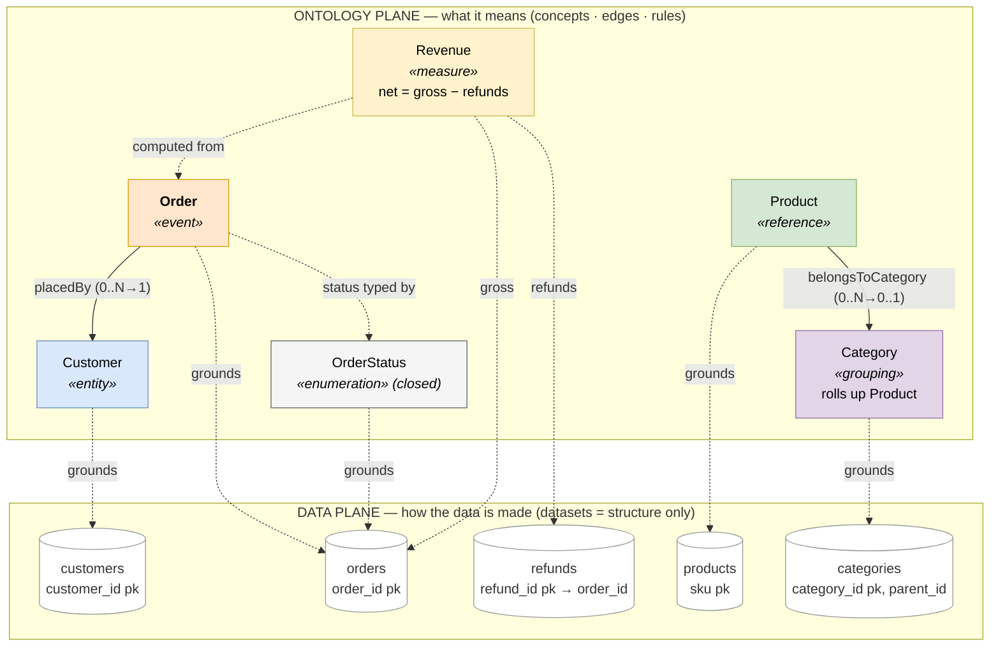
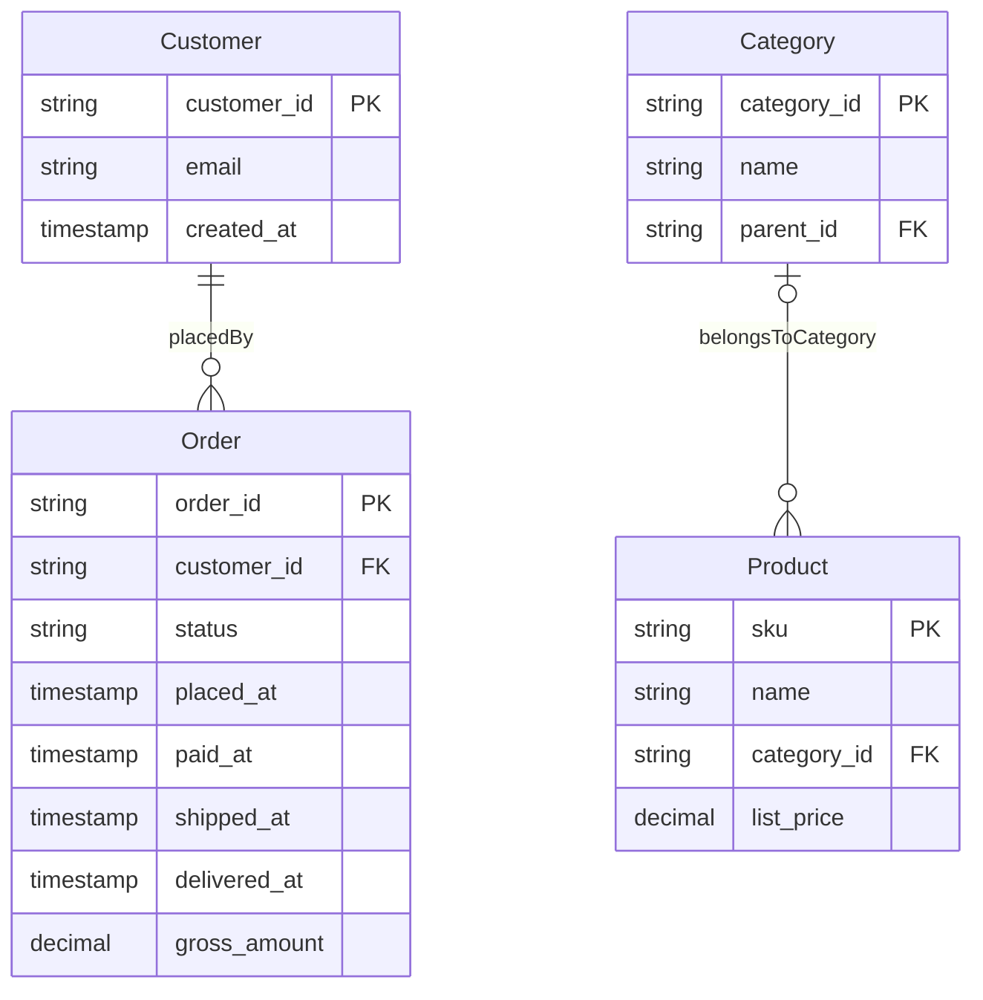

# The Shop Ontology — a worked example of the framework

A tiny, **synthetic** e-commerce ontology that applies the four-layer YAML framework end to end.
It exists to make the framework concrete: every construct the framework defines appears here, on a
neutral domain (an online shop), with no real data. It is the canonical worked example for
[`../FRAMEWORK.md`](../FRAMEWORK.md) and the key reference [`../CONCEPT_SPEC.md`](../CONCEPT_SPEC.md) —
read those for the *why* and the *what*, then read these files to see the framework applied.

## Project layout — two planes

This example uses the **two-plane layout** (see [`../reference_manual/data_plane.md`](../reference_manual/data_plane.md)),
declared in [`mac.project.yaml`](mac.project.yaml):

```
data/                 # STAGE 1 — how the data is made (the data plane)
  datasets/           #   the table/view schemas the ontology binds to  ← the seam
  quality/            #   recon_findings.md (the execution-validation loop)
ontology/             # STAGE 2 — what it means (the semantic plane)
  concepts/  edges.yaml  rules.yaml
```

The ontology references `data/datasets/` (the published schemas) and nothing else of the data plane —
dependencies flow ontology → datasets, never back. (`tpch`, the sibling example, stays **flat** — no
manifest — which is the back-compatible default.)

**Picture:** [`shop_ontology.drawio.svg`](shop_ontology.drawio.svg) (hand-laid-out) shows the whole thing —
the ontology plane (concepts coloured by class, edges as joins) over the data plane (the dataset
descriptors), with dashed grounding lines as the seam between them. The same diagram is kept as text in
[`shop_ontology.mmd`](shop_ontology.mmd) and rendered inline below (GitHub renders it natively):



And the **entity-relationship** view of the same model ([`projections/shop.er.mmd`](projections/shop.er.mmd),
generated by `mac_to_mermaid.py --er`) — entities are the grounded concepts, attributes are the dataset
columns (typed, PK/FK), relationships are the edges with crow's-foot cardinality:



This example also applies **Option B** (the design's end-state): the `data/datasets/` descriptors carry
**structure only** (name · type · key · role), and every column's **meaning** lives in the ontology as a
field-anchored `contract.rules[].binds` entry. So a column's prose isn't duplicated — it has one home, and
both the gates *and* the projectors read it there (see `projections/shop.okf/Order.md`, whose `# Schema`
notes are sourced from the rules, not from the descriptor).

## What it demonstrates

**All six concept classes, one each:**

| concept | class | file | shows |
| --- | --- | --- | --- |
| Customer | **entity** | `ontology/concepts/customer/customer.yaml` | a structured thing with identity |
| Order | **event** | `ontology/concepts/order/order.yaml` | the `lifecycle:` block (placed→…→returned, phases) |
| OrderStatus | **enumeration** | `ontology/concepts/order/order_status.yaml` | a closed `value_set:` |
| Product | **reference** | `ontology/concepts/catalog/product.yaml` | a dimension facts point at |
| Category | **grouping** | `ontology/concepts/catalog/category.yaml` | roll-up above the leaf (nested) |
| Revenue | **measure** | `ontology/concepts/finance/revenue.yaml` | additivity, unit, a derivation |

**All four layers:**

- **Concept** — the six files above (`ontology/concepts/`).
- **Rules** — `ontology/rules.yaml` → `net_revenue` (gross − refunds), the one derivation. Computation lives
  here, not inlined in `Revenue`.
- **Edges** — `ontology/edges.yaml` → `order__placed_by__customer`, `product__belongs_to__category`. Relations
  live here, not as properties of the concepts.
- **Physical** — `data/datasets/orders.yaml`, the grounding target the concepts point at.

**Field-anchoring** — `Order` and `Revenue` carry typed `contract.rules[]` **bound to the `orders`
columns they govern** (`binds`): order state ← `paid_at`/`shipped_at`/`delivered_at`, revenue-eligibility
← `paid_at`, net revenue ← `gross_amount`. The built-in `rule-binds-grounded` shape verifies, cross-file,
that every bind is a real column of the grounded table — a rule can't claim to govern a field the concept
doesn't ground.

**The execution-validation loop** — `data/quality/recon_findings.md` → FIND-SHOP-001: the first draft modelled
revenue as gross; it validated structurally but was 8% wrong because the data has refunds. Running the
query caught it; the model was corrected. *Structure ≠ correctness.*

## How to read it

1. Start with `ontology/concepts/order/order.yaml` — the richest concept (an event with a lifecycle).
2. See how `Revenue` (`ontology/concepts/finance/revenue.yaml`) points at a rule rather than inlining a formula
   — then read that rule in `ontology/rules.yaml`.
3. Note that `Order placed_by Customer` is in `ontology/edges.yaml`, not as a property on either — relations are
   their own layer.
4. Read `data/quality/recon_findings.md` for why a clean-validating model still needed execution to be correct.

## Note on validation

These files follow the canonical v0.1.6 shape and pass all three MAC gates. Run them together:

```sh
./validate.sh        # structural + referential + constraint, against this example (from anywhere)
```

It runs `validate_schema.py` (structural — closed vocabulary, required keys), `check_references.py`
(referential — internally whole, every `mac.*` term resolves), and `check_shapes.py` (constraint — the
built-in shapes) in order, and exits non-zero if any fails. A clean run means *well-formed and conformant*
(L1) — correctness of the data claims is a separate, execution-validation step (L2; see `data/quality/recon_findings.md`).

## From question to SQL

[QUERIES.md](QUERIES.md) turns four questions into SQL purely by reading the ontology (the `net_revenue`
rule becomes the `SELECT`; edges' `join_rule`s become the `JOIN`s) — including one question the model
**refuses**: net revenue by product category is *not derivable*, because no edge connects orders to
products. Encoding joins as data lets the model report that gap instead of fabricating a join.

## Projections

The same model, projected mechanically onto other platforms, lives in [`projections/`](projections/) (kept
apart from the hand-authored ontology — generated by the `tools/mac_to_*.py` projectors, ignored by the
gates): [`shop.ttl`](projections/shop.ttl) (RDF/OWL), [`shop.shacl.ttl`](projections/shop.shacl.ttl) (SHACL,
incl. the `OrderStatus` closed-enum `sh:in`), [`shop.graph.cypher`](projections/shop.graph.cypher)
(property graph), and [`shop.okf/`](projections/shop.okf/) (a Google Cloud OKF agent-knowledge bundle). See
the TPC-H example's README for the full projection table; the same projectors run on both.

*Synthetic data. No connection to any real shop or any real business data — the example is entirely
fabricated so it can be published and reused freely.*
